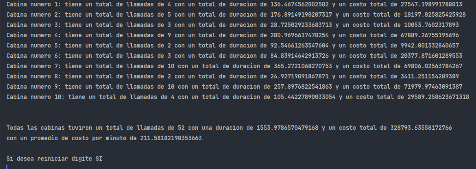

# Sistema de Control de Gastos Telefónicos

## Descripción del Proyecto

Este proyecto busca desarrollar una aplicación para controlar los gastos telefónicos de una empresa. La aplicación permitirá registrar llamadas, mostrar información detallada de cada cabina telefónica y un consolidado total de la información de todas las cabinas.

## Funcionalidades

* Registrar una llamada de acuerdo con la cabina telefónica
* Mostrar información detallada de la cabina telefónica:
    + Número de llamadas realizadas
    + Duración total de las llamadas en minutos
    + Costo total de las llamadas en pesos
* Mostrar un consolidado total de la información de las cabinas:
    + Costo total en pesos de la línea
    + Número total de llamadas realizadas
    + Duración total de llamadas en minutos
    + Cálculo del costo promedio por minuto según el costo total y el total de minutos
* Reiniciar el uso de la cabina telefónica, dejando todos sus valores en cero

## Tarifas

| Tipo de Llamada | Costo por Minuto |
| --- | --- |
| Local | $50 pesos |
| Larga Distancia | $350 pesos |
| Celular | $150 pesos |

## Instalación y Uso

Para ejecutar la aplicación, sigue estos pasos:

1. Asegúrate de tener instalado IntelliJ IDEA.
2. Abre el proyecto en IntelliJ IDEA.
3. Asegúrate de tener Gradle 8.10 configurado en tu proyecto.
4. Ejecuta el proyecto IntelliJ IDEA.
5. En caso de querer generar un archivo .jar debe configurar el archivo build.gradle.kts para indicar la función de ejecución. 

## Tecnologías Utilizadas

* Kotlin 2.0 como lenguaje de programación.
* Gradle 8.10 como sistema de construcción y gestión de dependencias.
* IntelliJ IDEA como entorno de desarrollo integrado (IDE).

## Contribuir

Si deseas contribuir al proyecto, sigue estos pasos:

1. Clona el repositorio en tu máquina local.
2. Crea una nueva rama para tus cambios.
3. Realiza tus cambios y asegúrate de probarlos.
4. Haz un push de tus cambios a la rama que creaste.
5. Crea un pull request para que tus cambios sean revisados y mergeados al repositorio principal.

## Demostración de funcionamiento correcto

